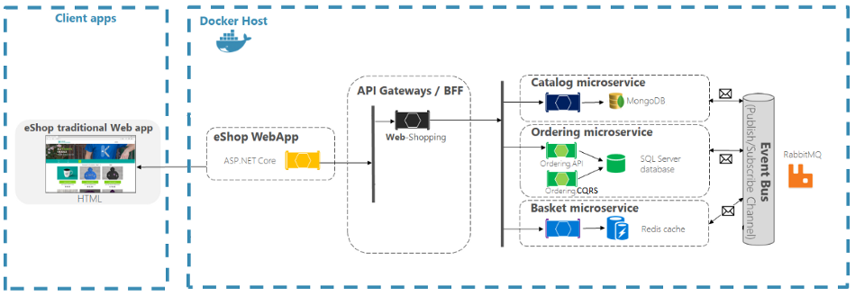

# Microservices Starter Kit

Run all dockerized microservices

`❯ docker-compose -f .\docker-compose.yml -f .\docker-compose.override.yml up --build`

| Services                 | Description                      | URL                           |
| ------------------------ | -------------------------------- | ----------------------------- |
| Product Catalog API      | ASP.NET Core Web API, MongoDB    | http://localhost:8000/swagger |
| Shopping Cart Basket API | ASP.NET Core Web API, Redis      | http://localhost:8001/swagger |
| Order API                | ASP.NET Core Web API, SQL Server | http://localhost:8002/swagger |
| Web App                  | ASP.NET Core                     | http://localhost:8003         |
| API Gateway              | Ocelet                           | http://localhost:7000         |
| Message Broker\*         | RabbitMQ                         | http://localhost:15672        |
| MS SQL\*\*               | Microsoft SQL Server             | (local)                       |

\*Message Broker - Username: guest, Password: guest

\*\*MS SQL - Username: sa, Password: _inside docker-compose.override.yml_

---

Alternaively, you can run following docker commands if you prefer to start containers individually.

| Services  | Description                                                                                                    |
| --------- | -------------------------------------------------------------------------------------------------------------- |
| MongoDB   | docker run -d -p 27017:27017 --name msk-mongo mongo                                                            |
| Redis     | docker run -d -p 6379:6379 --name msk-redis redis                                                              |
| Rabbit MQ | docker run -d --hostname my-rabbit --name some-rabbit -p 15672:15672 -p 5672:5672 rabbitmq:3-management-alpine |
| MS SQL    | docker run -e 'ACCEPT_EULA=Y' -e 'SA_PASSWORD=Pa\$\$w0rd' -p 1433:1433 -d mcr.microsoft.com/mssql/server       |

Note: If you already run those, next time you just use `docker ps -a`, get the container id and `docker start <CONTAINER ID>`.

# Troubleshooting

If some containers such as SQL are not loading properly, use the following commands -

Stop all running containers

`> docker ps`

`> docker stop <CONTAINER ID>`

Remove all containers

`> docker ps -a`

`> docker rm <CONTAINER ID>`

Remove all images

`> docker images`

`> docker rmi <IMAGE ID>`
